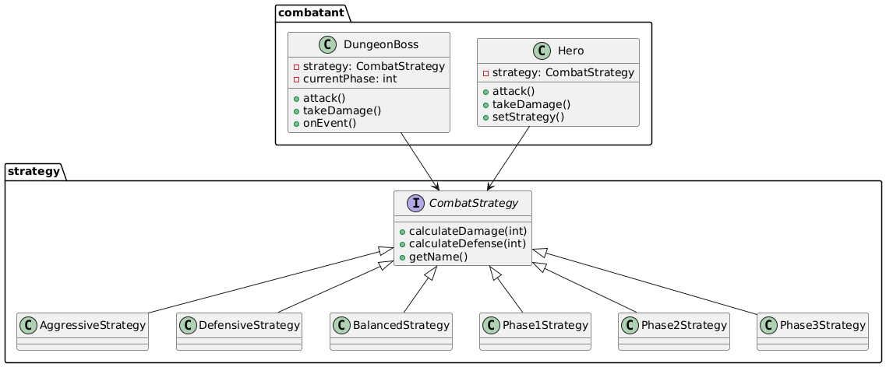
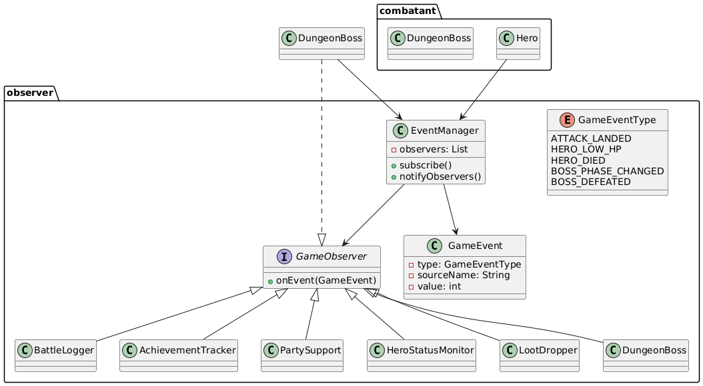

# Homework 7 — The Cursed Dungeon: Boss Encounter System

## Overview

In this assignment you will implement two behavioral design patterns — **Strategy** and **Observer** — inside a multi-phase dungeon boss encounter.

The boss adapts its fighting style as it takes damage. Every significant battle event (an attack landed, a hero falling low on HP, the boss crossing a phase threshold) notifies a set of independent observer systems that each react in their own way.

This homework builds on your **Homework 6** Hero class and round-based combat flow.

---

## Patterns Covered

| Pattern | Role in this system |
|---------|-------------------|
| **Strategy** | Defines how heroes and the boss calculate damage and defense. Strategies can be swapped at runtime — the boss switches automatically as it loses HP. |
| **Observer** | Decouples event producers (the engine, the boss) from event consumers (logger, achievements, party support, etc.). Publishers fire events; observers react independently. |

These two patterns are not independent in this system. The boss's strategy switch is **triggered by an observer notification** — discovering and implementing this connection is a core learning goal.

---

## What Is Provided

| File | Description |
|------|-------------|
| `src/com/narxoz/rpg/strategy/CombatStrategy.java` | Strategy interface |
| `src/com/narxoz/rpg/observer/GameObserver.java` | Observer interface |
| `src/com/narxoz/rpg/observer/GameEvent.java` | Event data class |
| `src/com/narxoz/rpg/observer/GameEventType.java` | Event type enum |
| `src/com/narxoz/rpg/combatant/Hero.java` | Hero skeleton (from HW6) |
| `src/com/narxoz/rpg/engine/EncounterResult.java` | Encounter result data class |
| `src/com/narxoz/rpg/Main.java` | Entry point skeleton |

Everything else — all concrete classes, the publisher mechanism, `DungeonBoss`, `DungeonEngine`, and all observer implementations — is yours to design and build.

---

## Quick Start

```bash
# Compile
javac -d out $(find src -name "*.java")

# Run
java -cp out com.narxoz.rpg.Main
```

See `QUICKSTART.md` for IDE setup and detailed instructions.

---

## Read Next

- `ASSIGNMENT.md` — full requirements, pattern contracts, and grading rubric
- `STUDENT_CHECKLIST.md` — phase-by-phase progress tracker
- `FAQ.md` — answers to common questions about the patterns and implementation

### Strategy


### Observer


## Ссылка на код
https://github.com/zarina-kulm/homework-rpg-7